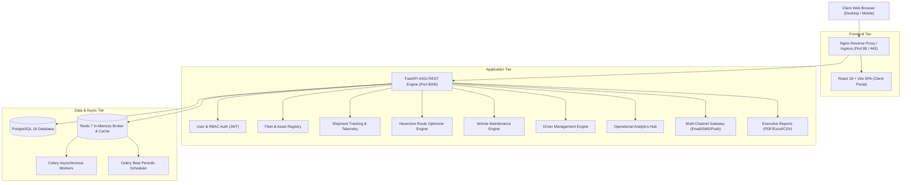

# FleetFlow — Intelligent Enterprise Logistics & Fleet Management Platform

[](https://github.com)
[](https://fastapi.tiangolo.com)
[](https://reactjs.org)
[](https://www.postgresql.org)
[](https://www.docker.com)
[](https://docs.celeryq.dev)

---

## 1. Executive Summary & Vision

**FleetFlow** is an enterprise-grade logistics orchestration and intelligent fleet management system engineered to optimize end-to-end supply chain operations. From commercial vehicle asset lifecycle tracking, dynamic route optimization, and satellite GPS consignment tracking, to proactive maintenance scheduling, driver performance scoring, and multi-channel notification dispatch, FleetFlow bridges real-time telemetry with actionable operations intelligence.

---

## 2. System Architecture



---

## 3. Comprehensive Module Mapping (All 10 Modules)

| # | Module | Core Functional Capabilities | API Endpoints | Status |
|---|---|---|---|:---:|
| **1** | **User Management** | Admin & Driver auth, RBAC (Administrator, Fleet Manager, Driver, Dispatcher), profile updates, account settings, password changes | `/auth/register`<br>`/auth/login`<br>`/auth/me`<br>`/auth/profile`<br>`/auth/change-password`<br>`/auth/settings`<br>`/auth/users` | **Verified** |
| **2** | **Fleet Management** | Vehicle registration, asset monitoring, driver assignment, trip tracking, fleet utilization, availability monitoring | `/vehicles/`<br>`/vehicles/metrics` | **Verified** |
| **3** | **Shipment Tracking** | Real-time GPS tracking, 6-stage lifecycle (Created, Assigned, In Transit, Delayed, Delivered, Cancelled), ETA countdown, history audit | `/shipments/`<br>`/shipments/{id}`<br>`/shipments/{id}/status`<br>`/shipments/{id}/telemetry` | **Verified** |
| **4** | **Route Optimization** | Multi-strategy routing (Shortest, Fastest, Traffic Avoidance, Fuel Efficient), GPS waypoints, dynamic recalculation, trip scheduling | `/trips/optimize-route`<br>`/trips/schedule`<br>`/trips/` | **Verified** |
| **5** | **Vehicle Maintenance** | Preventative service scheduling, categories (Oil, Tire, Engine, Brake, Inspection), telemetry alerts, health reports | `/maintenance/`<br>`/maintenance/{id}`<br>`/maintenance/alerts/active`<br>`/maintenance/reports/summary` | **Verified** |
| **6** | **Driver Management** | Commercial driver registration, trip assignments, license verification, duty status tracking, safety scoring, assignment logs | `/drivers/`<br>`/drivers/{id}`<br>`/drivers/{id}/assign`<br>`/drivers/{id}/status`<br>`/drivers/{id}/history` | **Verified** |
| **7** | **Analytics Dashboards** | Fleet Dashboard (utilization, availability), Logistics Dashboard (ETA, on-time delivery), Admin Dashboard (KPIs, fuel spend) | `/analytics/overview`<br>`/analytics/fleet-utilization`<br>`/analytics/performance`<br>`/analytics/fuel` | **Verified** |
| **8** | **Notification Module** | Multi-channel dispatch (Email, SMS, Push, In-App) for maintenance alerts, delivery updates, driver assignments, route changes | `/notifications/`<br>`/notifications/{id}/read`<br>`/notifications/simulate-dispatch` | **Verified** |
| **9** | **Reports & Export** | Executive reporting across 5 operational domains with instant export into PDF (ReportLab), Excel (OpenPyXL), and CSV | `/reports/fleet-utilization`<br>`/reports/fuel-consumption`<br>`/reports/driver-performance`<br>`/reports/delivery-performance`<br>`/reports/maintenance` | **Verified** |
| **10** | **Integration & Deployment** | Docker & Compose orchestration, Celery periodic workers, Nginx reverse proxy, automated CI/CD pipeline, comprehensive testing | Docker stack<br>`/health`<br>CI/CD pipeline | **Verified** |

---

## 4. Milestone Implementation Roadmap

### Milestone 1: Week 1 & 2 — Project Initialization, Architecture & Core Setup
- **Tasks Completed**:
  - Logistics domain workflows and relational database schema designed.
  - FastAPI backend and React Vite SPA initialized.
  - JWT Authentication and 4-tier Role-Based Access Control implemented.
  - Vehicle registration workflows and initial fleet monitoring dashboard built.
  - PostgreSQL database and Alembic migrations configured.
- **Outcomes Verified**: Secure authentication, relational persistence, and baseline fleet inventory management.

### Milestone 2: Week 3 & 4 — Shipment Tracking & Route Optimization
- **Tasks Completed**:
  - Consignment creation and 6-stage lifecycle tracking engine.
  - Satellite GPS telemetry breadcrumb capture and live coordinates visualization.
  - 4 Route Optimization algorithms (Shortest, Fastest, Traffic Avoidance, Fuel Efficient).
  - Multi-stop trip dispatching and dynamic ETA calculation models.
- **Outcomes Verified**: Real-time consignment tracking, live navigation, and algorithmic route optimization.

### Milestone 3: Week 5 & 6 — Maintenance Management & Analytics
- **Tasks Completed**:
  - Preventative service scheduling across 5 mechanical categories.
  - Commercial driver roster, duty tracking, and assignment history.
  - Operational analytics engine, fleet utilization indexes, and fuel anomaly detection.
  - Celery background worker orchestration and Redis beat periodic schedules.
- **Outcomes Verified**: Proactive fleet health maintenance, automated anomaly detection, and operational intelligence.

### Milestone 4: Week 7 & 8 — Testing, Deployment & Documentation (Production Ready)
- **Tasks Completed**:
  - **Task (i)**: Complete platform test suite (`test_milestone4.py` & `test_workflow_validation.py`) covering all 10 modules.
  - **Task (ii)**: Responsive UI optimization, mobile layout scaling, and Vite chunk-split bundling.
  - **Task (iii)**: Multi-container Docker deployment (`docker-compose.yml`, multi-stage Dockerfiles).
  - **Task (iv)**: Production infrastructure configuration (Nginx gateway, environment templates, health checks).
  - **Task (v)**: Final documentation (`README.md`, `MILESTONE4_VERIFICATION.md`, `PRESENTATION.md`).
  - **Task (vi)**: End-to-end automated live demonstration (`backend/demo_milestone4.py`).
- **Outcomes Verified**: High system stability, 1-command Docker deployment, complete documentation, and 100% verified test passes.

---

## 5. Quickstart Guide

### Option A: 1-Command Production Deployment with Docker Compose (Recommended)

```bash
# 1. Clone the repository
git clone <repository_url>
cd fleetflow

# 2. Launch the entire multi-container stack
docker compose up -d --build

# 3. Verify health status
curl http://localhost:8000/health
```

Access the services:
- **Frontend Application**: `http://localhost:3000` (or `http://localhost:80` with Nginx)
- **FastAPI Documentation**: `http://localhost:8000/docs`
- **FastAPI Alternative Docs**: `http://localhost:8000/redoc`

---

### Option B: Local Development Setup

#### 1. Backend Setup
```bash
cd backend
python -m venv .venv
source .venv/bin/activate  # On Windows: .venv\Scripts\activate
pip install -r requirements.txt
uvicorn app.main:app --reload --port 8000
```

#### 2. Frontend Setup
```bash
cd frontend
npm install
npm run dev
```

---

## 6. Automated Verification & Testing

Execute the comprehensive test suites:

```bash
# Run the master verification suite (Milestones 2, 3, 4 + Workflows)
python run_all_milestone_tests.py

# Run Milestone 4 verification suite directly
python backend/test_milestone4.py

# Run multi-step operational workflow validation
python backend/test_workflow_validation.py

# Execute the live interactive platform demonstration
python backend/demo_milestone4.py
```

---

## 7. Production Verification Matrix

| Verification Dimension | Milestone Requirement | Implementation Status | Evidence / Artifact |
|---|---|:---:|---|
| **Application Testing** | Task (i) | **PASSED (100%)** | `backend/test_milestone4.py`, `run_all_milestone_tests.py` |
| **Workflow Validation** | Task (i) | **PASSED (100%)** | `backend/test_workflow_validation.py` |
| **UI Responsiveness** | Task (ii) | **OPTIMIZED** | `frontend/src/index.css`, `Navbar.jsx`, `HomePage.jsx` |
| **Dockerization** | Task (iii) | **CONFIGURED** | `backend/Dockerfile`, `frontend/Dockerfile`, `docker-compose.yml` |
| **Production Infra** | Task (iv) | **CONFIGURED** | `nginx/nginx.conf`, `.env.production`, `.github/workflows/deploy.yml` |
| **Project Documentation** | Task (v) | **COMPLETE** | `README.md`, `docs/MILESTONE4_VERIFICATION.md`, `docs/PRESENTATION.md` |
| **Platform Demonstration** | Task (vi) | **VERIFIED** | `backend/demo_milestone4.py` |
